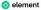

**Element Synapse - Matrix homeserver implementation**

|support| |development| |documentation| |license| |pypi| |python|

Synapse is an open source `Matrix <https://matrix.org>`__ homeserver
implementation, written and maintained by `Element <https://element.io>`_.
`Matrix <https://github.com/matrix-org>`__ is the open standard for secure and
interoperable real-time communications. You can directly run and manage the
source code in this repository, available under an AGPL license (or
alternatively under a commercial license from Element).

There is no support provided by Element unless you have a subscription from
Element.

🚀 Getting started
==================

This component is developed and maintained by `Element <https://element.io>`_.
It gets shipped as part of the **Element Server Suite (ESS)** which provides the
official means of deployment.

ESS is a Matrix distribution from Element with focus on quality and ease of use.
It ships a full Matrix stack tailored to the respective use case.

There are three editions of ESS:

- `ESS Community <https://github.com/element-hq/ess-helm>`_ - the free Matrix
  distribution from Element tailored to small-/mid-scale, non-commercial
  community use cases
- `ESS Pro <https://element.io/server-suite>`_ - the commercial Matrix
  distribution from Element for professional use
- `ESS TI-M <https://element.io/server-suite/ti-messenger>`_ - a special version
  of ESS Pro focused on the requirements of TI-Messenger Pro and ePA as
  specified by the German National Digital Health Agency Gematik

🛠️ Standalone installation and configuration
============================================

The Synapse documentation describes `options for installing Synapse standalone
<https://element-hq.github.io/synapse/latest/setup/installation.html>`_. See
below for more useful documentation links.

- `Synapse configuration options <https://element-hq.github.io/synapse/latest/usage/configuration/config_documentation.html>`_
- `Synapse configuration for federation <https://element-hq.github.io/synapse/latest/federate.html>`_
- `Using a reverse proxy with Synapse <https://element-hq.github.io/synapse/latest/reverse_proxy.html>`_
- `Upgrading Synapse <https://element-hq.github.io/synapse/develop/upgrade.html>`_

🎯 Troubleshooting and support
==============================

🚀 Professional support
-----------------------

Enterprise quality support for Synapse including SLAs is available as part of an
`Element Server Suite (ESS) <https://element.io/pricing>`_ subscription.

If you are an existing ESS subscriber then you can raise a `support request <https://ems.element.io/support>`_
and access the `Element product documentation <https://docs.element.io>`_.

🤝 Community support
--------------------

The `Admin FAQ <https://element-hq.github.io/synapse/latest/usage/administration/admin_faq.html>`_
includes tips on dealing with some common problems. For more details, see
`Synapse's wider documentation <https://element-hq.github.io/synapse/latest/>`_.

For additional support installing or managing Synapse, please ask in the community
support room |room|_ (from a matrix.org account if necessary). We do not use GitHub
issues for support requests, only for bug reports and feature requests.

.. |room| replace:: ``#synapse:matrix.org``
.. _room: https://matrix.to/#/#synapse:matrix.org

.. |docs| replace:: ``docs``
.. _docs: docs

🛠️ Development
==============

We welcome contributions to Synapse from the community!
The best place to get started is our
`guide for contributors <https://element-hq.github.io/synapse/latest/development/contributing_guide.html>`_.
This is part of our broader `documentation <https://element-hq.github.io/synapse/latest>`_, which includes
information for Synapse developers as well as Synapse administrators.

Developers might be particularly interested in:

* `Synapse's database schema <https://element-hq.github.io/synapse/latest/development/database_schema.html>`_,
* `notes on Synapse's implementation details <https://element-hq.github.io/synapse/latest/development/internal_documentation/index.html>`_, and
* `how we use git <https://element-hq.github.io/synapse/latest/development/git.html>`_.

Alongside all that, join our developer community on Matrix:
`#synapse-dev:matrix.org <https://matrix.to/#/#synapse-dev:matrix.org>`_, featuring real humans!

Copyright and Licensing
=======================

  | Copyright 2014–2017 OpenMarket Ltd
  | Copyright 2017 Vector Creations Ltd
  | Copyright 2017–2025 New Vector Ltd
  | Copyright 2025 Element Creations Ltd

This software is dual-licensed by Element Creations Ltd (Element). It can be
used either:

(1) for free under the terms of the GNU Affero General Public License (as
    published by the Free Software Foundation, either version 3 of the License,
    or (at your option) any later version); OR

(2) under the terms of a paid-for Element Commercial License agreement between
    you and Element (the terms of which may vary depending on what you and
    Element have agreed to).

Unless required by applicable law or agreed to in writing, software distributed
under the Licenses is distributed on an "AS IS" BASIS, WITHOUT WARRANTIES OR
CONDITIONS OF ANY KIND, either express or implied. See the Licenses for the
specific language governing permissions and limitations under the Licenses.

Please contact `licensing@element.io <mailto:licensing@element.io>`_ to purchase
an Element commercial license for this software.

.. |support| image:: https://img.shields.io/badge/matrix-community%20support-success
  :alt: (get community support in #synapse:matrix.org)
  :target: https://matrix.to/#/#synapse:matrix.org

.. |development| image:: https://img.shields.io/matrix/synapse-dev:matrix.org?label=development&logo=matrix
  :alt: (discuss development on #synapse-dev:matrix.org)
  :target: https://matrix.to/#/#synapse-dev:matrix.org

.. |documentation| image:: https://img.shields.io/badge/documentation-%E2%9C%93-success
  :alt: (Rendered documentation on GitHub Pages)
  :target: https://element-hq.github.io/synapse/latest/

.. |license| image:: https://img.shields.io/github/license/element-hq/synapse
  :alt: (check license in LICENSE file)
  :target: LICENSE

.. |pypi| image:: https://img.shields.io/pypi/v/matrix-synapse
  :alt: (latest version released on PyPi)
  :target: https://pypi.org/project/matrix-synapse

.. |python| image:: https://img.shields.io/pypi/pyversions/matrix-synapse
  :alt: (supported python versions)
  :target: https://pypi.org/project/matrix-synapse
